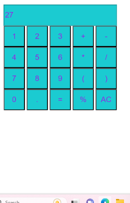
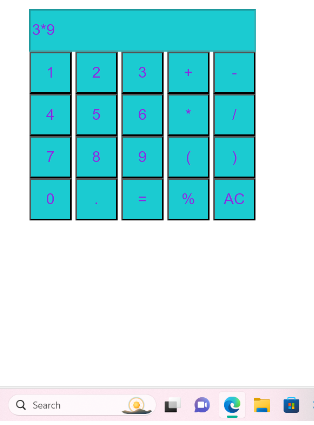

# Ex.08 Design of a Standard Calculator
## Date:27.4.2024

## AIM:
To design a web application for a standard calculator with minimum five operations.

## DESIGN STEPS:

### Step 1:
Clone the github repository and create Django admin interface.

### Step 2:
Change settings.py file to allow request from all hosts.

### Step 3:
Use CSS for creating attractive colors.

### Step 4:
Write JavaScript program for implementing five different operations.

### Step 5:
Validate the HTML and CSS code.

### Step 6:
Publish the website in the given URL.

## PROGRAM :
~~~
<html>
<!DOCTYPE html>
<html lang="en">
<head>
    <meta charset="UTF-8">
    <meta name="viewport" content="width=device-width, initial-scale=1.0">
    <title>Simple Calculator</title>
    
</head>
<body>
    <h2>Monika D</h2>
    <form name="calculator">
        <input type="text" style="width:269px" name="display" id="display" disabled>
         
        <input type="button" value="1" onclick="addToDisplay('1')">
        <input type="button" value="2" onclick="addToDisplay('2')">
        <input type="button" value="3" onclick="addToDisplay('3')">
        <input type="button" value="+" onclick="addToDisplay('+')">
        <input type="button" value="-" onclick="addToDisplay('-')">
         
        <input type="button" value="4" onclick="addToDisplay('4')">
        <input type="button" value="5" onclick="addToDisplay('5')">
        <input type="button" value="6" onclick="addToDisplay('6')">
        <input type="button" value="*" onclick="addToDisplay('*')">
        <input type="button" value="/" onclick="addToDisplay('/')">
         
        <input type="button" value="7" onclick="addToDisplay('7')">
        <input type="button" value="8" onclick="addToDisplay('8')">
        <input type="button" value="9" onclick="addToDisplay('9')">
        <input type="button" value="(" onclick="addToDisplay('(')">
        <input type="button" value=")" onclick="addToDisplay(')')">
         
        <input type="button" value="0" onclick="addToDisplay('0')">
        <input type="button" value="." onclick="addToDisplay('.')">
        <input type="button" value="=" onclick="calculate()">
        <input type="button" value="%" onclick="addToDisplay('%')">
        <input type="button" value="AC" onclick="clearDisplay()">
    </form>

    

</body>
</html>

~~~

## OUTPUT:

## RESULT:
The program for designing a standard calculator using HTML and CSS is executed successfully.
